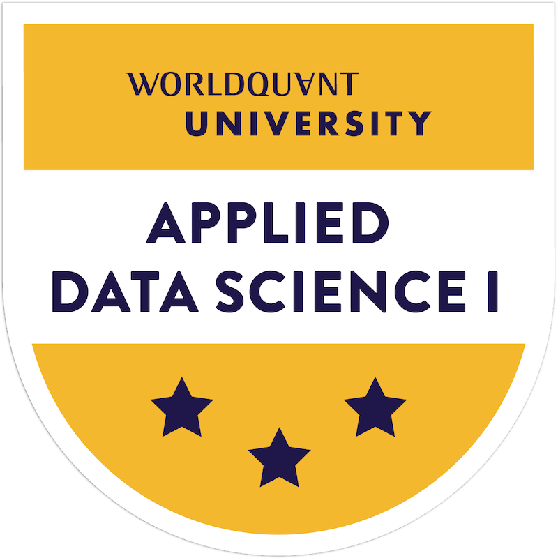

# WorldQuant University's Applied Data Science Module

The module consists of eight-week unit that challenge students to find several ways to solve problems through data analysis. Hands-on approach ensures the skills students acquire translate seamlessly into the workplace.

## Applied Data Science I: 
Scientific Computing & Python

## Skills Used : 
Data Wrangling, Basic + Advanced Data Analysis, Python Basic Syntax + Data Structures, Object Oriented Programming CSV, For Loops, While Loops, JSON, NumPy, Pandas, SQL

## Badge: ([credly](https://www.credly.com/badges/46dc0a0f-b0d1-4f17-afb5-28c22191d2b6/public_url))

